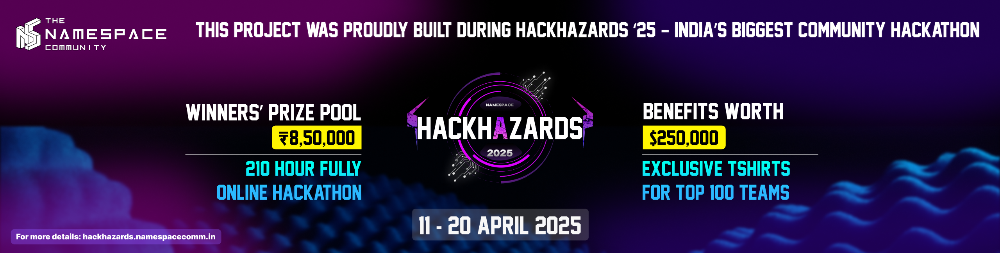

# 🚀 ChainPass

> A decentralized event access system powered by blockchain technology on Base Chain.

---

## 📌 Problem Statement

**Problem Statement 4 – Creaft The Future Of Onchain Consumer Experience With Base**

ChainPass addresses challenges in event ticketing and management by leveraging blockchain to create a secure, transparent system accessible to all communities.

---

## 🎯 Objective

ChainPass solves the problems of ticket counterfeiting, scalping, and lack of transparency in event management. Our platform serves event organizers, attendees, and venues with a secure, transparent ticketing solution.

By bringing blockchain technology to event management, we enable trustless verification, eliminate fraud, and provide a seamless experience from ticket purchase through check-in and rewards distribution.

---

## 🧠 Team & Approach

## Solo Developer 
* Sayan Ghosh (GitHub: @Sayan-ghs / Role: Full-stack Developer)

### My Approach:

* I chose this problem because the ticketing industry suffers from fraud, lack of transparency, and high fees
* Key challenges we addressed include on-chain verification, user-friendly wallet integration, and creating visually appealing NFT tickets
* Breakthrough was developing a modular smart contract architecture that allows for flexible event management with minimal gas costs

---

## 🛠️ Tech Stack

### Core Technologies Used:

* **Frontend:** React, TailwindCSS, Vite
* **Backend:** Smart Contracts (Solidity)
* **Database:** Blockchain (Base Chain)
* **APIs:** WalletConnect, BaseScan
* **Hosting:** Vercel

### Sponsor Technologies Used:

* **Base:** ✅ OnchainKit for wallet integration & Smart Contract deployment
*

---

## ✨ Key Features

* ✅ **NFT Ticket Minting** - Create and purchase event tickets as NFTs with optional soulbound functionality
* ✅ **On-chain Check-in System** - Secure verification of attendance with QR codes or wallet connection
* ✅ **Rewards Distribution** - Claim NFTs, tokens, or POAPs as rewards for attending events
* ✅ **Intuitive Event Management** - Create, edit, and manage events with a beautiful interface
* ✅ **Transaction Notifications** - Real-time feedback for all blockchain interactions

<!-- Replace placeholder with actual logo once available -->


---

## 📽️ Demo & Deliverables

* **Demo Video Link:** [YouTube Demo](./)
* **Pitch Deck Link:** [Presentation](./)

---

## 🧪 How to Run the Project

### Requirements:

* Node.js v16+ and npm
* MetaMask or another Ethereum wallet
* Base Sepolia testnet ETH (for testing)

### Local Setup:

```bash
# Clone the repo
git clone https://github.com/Sayan-ghs/ChainPass

# Install dependencies
cd ChainPass
npm install

# Set up environment variables (copy from .env.example)
cp .env.example .env

# Start development server
npm run dev
```

For contract deployment:
```bash
npm run compile
npm run deploy
```

---

## 🧬 Future Scope

* 📈 **Multi-chain Support** - Expand beyond Base to other EVM compatible chains
* 🛡️ **Enhanced Verification** - Add biometric verification for high-security events
* 🌐 **Physical/Digital Hybrid** - Integration with physical access control systems
* 💰 **Secondary Market** - Controlled resale marketplace with royalties to organizers
* 🎭 **Dynamic NFT Tickets** - Tickets that change appearance based on event attendance

---

## 📎 Resources / Credits

* Base Chain documentation and starter kits
* OpenZeppelin for secure contract templates
* WalletConnect for the wallet integration
* TailwindCSS for UI components

---

## 🏁 Final Words

Our journey building ChainPass has been challenging but rewarding. As blockchain enthusiasts, creating an application that solves real-world problems while exploring cutting-edge technology has been an incredible experience. We believe ChainPass has the potential to revolutionize how events are organized, attended, and experienced.

Special thanks to the HackHazards25 team for organizing this hackathon and providing us with the platform to showcase our idea!

--- 